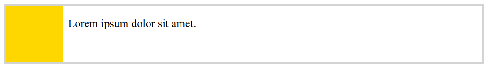
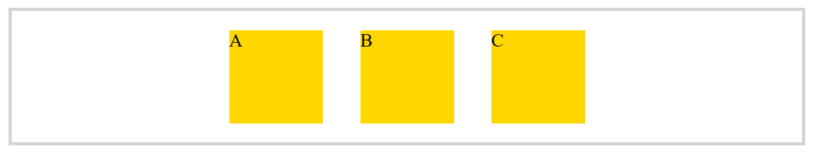
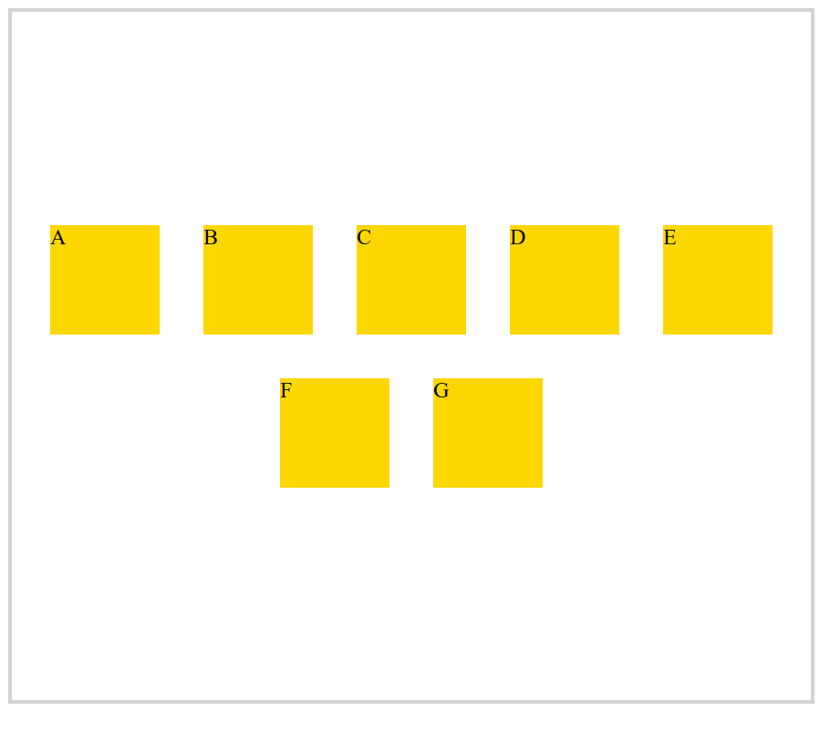
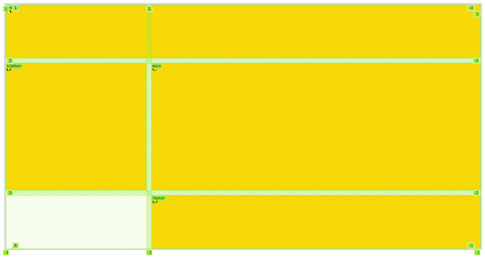
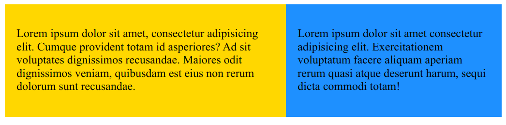
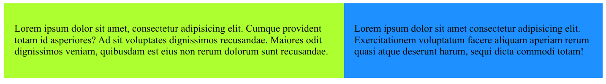

# css

## Stylesheet Link

```html
<!DOCTYPE html>
<html lang="en">
    <head>
        <meta charset="UTF-8" />
        <title>HTML</title>
        <link rel="stylesheet" href="styles.css" />
    </head>
    <body>
        <p>Lorem ipsum dolor sit amet.</p>
        <p>Lorem ipsum dolor sit amet.</p>
    </body>
</html>
```

styles.css

```css
p {
    color: orange;
}
```

## Embedded Styles

```html
<!DOCTYPE html>
<html lang="en">
    <head>
        <meta charset="UTF-8" />
        <title>HTML</title>
        <style>
            p {
                color: orange;
            }
        </style>
    </head>
    <body>
        <p>Lorem ipsum dolor sit amet.</p>
        <p>Lorem ipsum dolor sit amet.</p>
    </body>
</html>
```

Embedded styles override the stylesheet link.

## Inline Styles

```html
<p style="color: blue; font-weight: bold">Lorem ipsum dolor sit amet.</p>
```

Inline styles override all other styles.

## normalize.css

https://necolas.github.io/normalize.css/

Different browsers have different default values for margin and so on.

Make it the first link.

```html
<link rel="stylesheet" href="css/normalize.css" />
```

## CSS Selectors

element

```css
body {
    margin: 10px;
}
```

class

```css
.user {
    margin: 10px;
}
```

id

```css
#user1 {
    margin: 10px;
}
```

attribute

```css
a[target] {
}

a[target='_blank'] {
}
```

attribute contains text

```css
a[href*='google'] {
}
```

attribute starts with text

```css
a[href^='https'] {
}
```

attribute ends with text

```css
a[href$='com'] {
}
```

attribute starts and ends with text

```css
a[href^='https'$='com'] {
}
```

## Relational Selectors

Descentant Selector

```html
<section id="products">
    <p>Lorem ipsum dolor sit amet.</p>
    <article>
        <p>Lorem ipsum dolor sit amet consectetur adipisicing elit.</p>
    </article>
</section>
```

Will make all descendent p elements red, not just the immediate children:

```css
#products p {
    color: red;
}
```

Will just make the immediate children red:

```css
#products > p {
    color: red;
}
```

Will make the immediate sibling p element red:

```css
#products + p {
    color: red;
}
```

Will make all general siblings p elements red:

```css
#products ~ p {
    color: red;
}
```

## Pseudo-class Selectors

First child

```css
article :first-child {
    font-size: 145%;
    font-style: italic;
}
```

First of type p element

```css
article p:first-of-type {
    font-size: 145%;
    font-style: italic;
}
```

Last of type p element

```css
article p:last-of-type {
    font-weight: bold;
}
```

Last child

```css
article :last-child {
    font-weight: bold;
}
```

Odds, evens and every third

```css
ul li:nth-child(odd) {
    background-color: #f0f0f0;
}

ul li:nth-child(even) {
    background-color: #773838;
}

ul li:nth-child(3n) {
    font-style: oblique;
}
```

Visited, link, hover, focus

```css
a:visited,
a:link {
    color: dodgerblue;
}

a:hover,
a:focus {
    color: deeppink;
}
```

## Pseudo Elements

```css
p::first-letter {
    font-size: 200%;
    font-weight: bold;
}

p::first-line {
    font-style: italic;
}

::selection {
    background-color: pink;
}

p::before {
    content: '...';
}
p::after {
    content: '...';
    display: block;
}
```

## Selector Specificty

-   id selector is most specific
-   class selector is second most specific
-   tag / class selector is third most specific

So if you target one id, two classes and four tags, the specificity is `124`.

```css
#user1 .users .people h1 h2 h3 p {
    color: green;
}
```

Hover over the selector in vscode and it will show you.

If two selectors have the same specificity, the one that appears later in the CSS file will override the one that appears earlier.

Can use `!important` to override, but don't do it.

```css
h1 {
    color: green !important;
}
```

## Inheritance

```css
p {
    color: dodgerblue;
    border: 1px solid black;
}

strong {
    color: initial;
    border: inherit;
}
```

Typography generally gets inherited. Can be turned off using `initial`.

For properties that are not inherited, use `inherit`.

## Colours

Google `color picker`.

rgb

```css
.box {
    width: 200px;
    height: 250px;
    background-color: rgb(50, 101, 184);
}
```

rgb with alpha channel (0 to 1)

```css
.box {
    width: 200px;
    height: 200px;
    background-color: rgba(50, 101, 184, 0.5);
}
```

hex system does not have alpha channel

```css
.box {
    width: 200px;
    height: 200px;
    background-color: #f5f5f5;
}
```

hsl system - hue, saturation, lightness

```css
.box {
    width: 200px;
    height: 200px;
    background-color: hsl(25, 40%, 80%);
}
```

With the hsl system you start with a base colour then you play with the saturation and lightness.

hsla system - hue, saturation, lightness, alpha channel

```css
.box {
    width: 200px;
    height: 200px;
    background-color: hsla(25, 40%, 80%, 0.5);
}
```

## Linear Gradient

```html
<!DOCTYPE html>
<html lang="en">
    <head>
        <meta charset="UTF-8" />
        <title>HTML</title>
        <link rel="stylesheet" href="css/normalize.css" />
        <link rel="stylesheet" href="css/styles.css" />
    </head>
    <body>
        <div class="box"></div>
    </body>
</html>
```

```css
.box {
    width: 200px;
    height: 200px;
    background: linear-gradient(dodgerblue, yellow);
}
```

```css
.box {
    width: 200px;
    height: 200px;
    background: linear-gradient(to right, dodgerblue, yellow);
}
```

```css
.box {
    width: 200px;
    height: 200px;
    background: linear-gradient(to bottom right, dodgerblue, yellow);
}
```

```css
.box {
    width: 200px;
    height: 200px;
    background: linear-gradient(45deg, dodgerblue, yellow);
}
```

```css
.box {
    width: 200px;
    height: 200px;
    background: linear-gradient(45deg, dodgerblue, yellow 30%);
}
```

```css
.box {
    width: 200px;
    height: 200px;
    background: linear-gradient(45deg, dodgerblue, yellow 30%, orange);
}
```

## Radial Gradient

```css
.box {
    width: 400px;
    height: 200px;
    background: radial-gradient(dodgerblue, yellow 30%, orange);
}
```

```css
.box {
    width: 400px;
    height: 200px;
    background: radial-gradient(circle, dodgerblue, yellow 30%, orange);
}
```

```css
.box {
    width: 400px;
    height: 200px;
    background: radial-gradient(circle at top left, dodgerblue, yellow 30%, orange);
}
```

https://cssgradient.io

## Borders

```css
.box {
    width: 400px;
    height: 200px;
    background: dodgerblue;
    border: 10px solid royalblue;
}
```

```css
.box {
    width: 400px;
    height: 200px;
    background: dodgerblue;
    border: 10px dotted royalblue;
}
```

```css
.box {
    width: 400px;
    height: 200px;
    background: dodgerblue;
    border: 10px dashed royalblue;
}
```

```css
.box {
    width: 400px;
    height: 200px;
    background: dodgerblue;
    border: 10px dashed royalblue;
    border-top: 20px solid royalblue;
}
```

top right bottom left

```css
.box {
    width: 400px;
    height: 200px;
    background: dodgerblue;
    border: 10px dashed royalblue;
    border-width: 10px 20px 30px 5px; /* top right bottom left */
}
```

rounded corners (will apply to any shadow also)

```css
.box {
    width: 400px;
    height: 200px;
    background: dodgerblue;
    border: 10px dashed royalblue;
    border-radius: 30px;
}
```

make a cirlce

```css
.box {
    width: 200px;
    height: 200px;
    background: dodgerblue;
    border: 10px dashed royalblue;
    border-radius: 100%;
}
```

https://css-tricks.com/the-shapes-of-css

## Shadows

```css
.box {
    width: 200px;
    height: 200px;
    background: dodgerblue;
    box-shadow: 10px 10px;
}
```

```css
body {
    margin: 10px;
}

.box {
    width: 200px;
    height: 200px;
    background: dodgerblue;
    box-shadow: -10px 10px;
}
```

Make a softer shadow, and grey

```css
.box {
    width: 200px;
    height: 200px;
    background: dodgerblue;
    box-shadow: 10px 10px 10px grey;
}
```

Suttle grey shadow all around

```css
.box {
    width: 200px;
    height: 200px;
    background: dodgerblue;
    box-shadow: 0 0 30px grey;
}
```

Shadow of heading blends with background

```html
<!DOCTYPE html>
<html lang="en">
    <head>
        <meta charset="UTF-8" />
        <title>HTML</title>
        <link rel="stylesheet" href="css/normalize.css" />
        <link rel="stylesheet" href="css/styles.css" />
    </head>
    <body>
        <div class="box">
            <h1>Heading</h1>
        </div>
    </body>
</html>
```

```css
.box {
    width: 200px;
    height: 200px;
    background: gold;
    box-shadow: 0 0 30px grey;
}

h1 {
    color: white;
    text-shadow: 3px 3px 5px rgba(0, 0, 0, 0.2);
}
```

## Excercise - make a table

```html
<!DOCTYPE html>
<html lang="en">
    <head>
        <meta charset="UTF-8" />
        <title>HTML</title>
        <link rel="stylesheet" href="css/normalize.css" />
        <link rel="stylesheet" href="css/styles.css" />
    </head>
    <body>
        <table>
            <thead>
                <tr>
                    <th>Country</th>
                    <th>OrderID</th>
                    <th>Order Amount</th>
                </tr>
            </thead>
            <tbody>
                <tr>
                    <td>USA</td>
                    <td>1001</td>
                    <td>$1,300</td>
                </tr>
                <tr>
                    <td>USA</td>
                    <td>1001</td>
                    <td>$700</td>
                </tr>
                <tr>
                    <td>CA</td>
                    <td>1002</td>
                    <td>$2,000</td>
                </tr>
                <tr>
                    <td>CA</td>
                    <td>1003</td>
                    <td>$1,000</td>
                </tr>
            </tbody>
            <tfoot>
                <tr>
                    <th>Total</th>
                    <th></th>
                    <th>$5,000</th>
                </tr>
            </tfoot>
        </table>
    </body>
</html>
```

```css
body {
    margin: 10px;
}

table,
td,
th {
    border-collapse: collapse;
    padding: 10px;
}

thead,
tfoot {
    background-color: #427fef;
    color: #fff;
    text-align: left;
}

td {
    border-top: 1px solid #c4dcf3;
    border-bottom: 1px solid #c4dcf3;
}

tbody tr:nth-child(odd) {
    background-color: #eef7ff;
}
```

## Box model

margin -> border -> padding -> content

Use margin to space out content to take advantage of margin collapsing.

Padding is used to add space around the content to the border.

content-box is the default box sizing method

-   100px for the content width, 2*20px for the padding, 2*10px for the border = 160px width

```css
.box {
    width: 100px;
    height: 100px;
    background: gold;
    padding: 20px;
    border: 10px solid orange;
    box-sizing: content-box;
}
```

broder-box makes the width and height be calculated from the border

-   So 2*20px for the padding, 2*10px for the border leaves 40px for the content width

```css
.box {
    width: 100px;
    height: 100px;
    background: gold;
    padding: 20px;
    border: 10px solid orange;
    box-sizing: border-box;
}
```

The width and height properties are only applied to block level elements.

## Universal selector Change the default from content-box to border-box

```css
* {
    box-sizing: border-box;
}
```

But does not apply to pseudo elements!

So do this

```css
*,
*::before,
*::after {
    box-sizing: border-box;
}
```

## Put two boxes beside each other with inline-block

```css
.box {
    width: 100px;
    height: 100px;
    background: gold;
    padding: 20px;
    border: 10px solid orange;
    box-sizing: border-box;
    display: inline-block;
}
```

There will be a space between the boxes with inline-block

```html
<span class="box">Box</span> <span class="box">Box</span>
```

But if you put the two spans right beside each other, the space goes away

```html
<span class="box">Box</span><span class="box">Box</span>
```

## Overflow

If your content is too big for the box, by default it will overflow.

You can choose to hide, or have scroll bars. `auto` is a good option.

```css
.box {
    border: 3px solid gold;
    width: 150px;
    height: 150px;
    overflow: auto;
}
```

## Measurement Units

`px` is absolute

`%` is relative to the container size

`vw` and `vh` are relative to the viewport size

`em` and `rem` are relative to the font size

If you set the width to 10em, that would be 10 times the font size of the element.
If it doesn't have a font size, it inherits it from the parent element.
By default it is 16px for the `html` element.

If you set the height to 95vh, that would be 95% of the viewport height.

`div` elements have a 0 height by default, the height will grow according to content.

If you use `rem` then it is 10x the font size of the root elment.

In `html` element, can set the font-size to `62.5%` which would be 10px be default - easier for making calculations.

## Positioning

```html
<!DOCTYPE html>
<html lang="en">
    <head>
        <meta charset="UTF-8" />
        <title>HTML</title>
        <link rel="stylesheet" href="css/normalize.css" />
        <link rel="stylesheet" href="css/styles.css" />
    </head>
    <body>
        <div class="boxes">
            <div class="box box-one"></div>
            <div class="box box-two"></div>
            <div class="box box-three"></div>
        </div>
    </body>
</html>
```

```css
body {
    margin: 10px;
}

.boxes {
    border: 3px solid lightgrey;
    position: relative;
}

.box {
    width: 5rem;
    height: 5rem;
}

.box-one {
    background-color: gold;
}

.box-two {
    background-color: tomato;
    position: relative;
    left: 4rem;
    bottom: 4rem;
    z-index: -3;
}

.box-three {
    background-color: dodgerblue;
}
```

Set the position to `relative`.

Can use `left` `right` `top` `bottom` to move the container around.

`z-index` defaults to 0, lower numbers make it further away, higher numbers closer.

If you set the `boxes` class to `relative` you can then make `box-two` have
an `absolute` position as follows

```css
.box-two {
    background-color: tomato;
    position: absolute;
    right: 0;
    top: 0;
    z-index: 99999;
}
```

It will be removed from the flow of the page, so `box-three` will move up.

With `fixed` position the container stays in place even on scroll.

## Floating Elements

`parent` elements do not see floated elements.

When we use floats we should `clear` afterwards.

```html
<!DOCTYPE html>
<html lang="en">
    <head>
        <meta charset="UTF-8" />
        <title>HTML</title>
        <link rel="stylesheet" href="css/normalize.css" />
        <link rel="stylesheet" href="css/styles.css" />
    </head>
    <body>
        <article class="tweet clearfix">
            <div class="avatar"></div>
            <p>Lorem ipsum dolor sit amet.</p>
        </article>
    </body>
</html>
```

```css
body {
    margin: 10px;
}

.tweet {
    border: 3px solid lightgrey;
}

.clearfix::after {
    content: '';
    display: block;
    clear: both;
}

.avatar {
    width: 5rem;
    height: 5rem;
    background-color: gold;
    float: left;
    margin-right: 0.5rem;
}

.clear {
    clear: both;
}
```



Use `FlexBox` and `Grid` instead, `Floating Elements` is a legacy approach.

## FlexBox

Used for laying out elements in one direction.

There is a main axis and a cross axis.

It depends on whether you are using `row` or `column` for the `flex-direction`.

Align items with `justify-content` (main axis) and `align-items` (cross axis).

```html
<!DOCTYPE html>
<html lang="en">
    <head>
        <meta charset="UTF-8" />
        <title>HTML</title>
        <link rel="stylesheet" href="css/normalize.css" />
        <link rel="stylesheet" href="css/styles.css" />
    </head>
    <body>
        <div class="container">
            <div class="box">A</div>
            <div class="box">B</div>
            <div class="box">C</div>
        </div>
    </body>
</html>
```

```css
body {
    margin: 10px;
}

.container {
    border: 3px solid lightgrey;
    display: flex;
    flex-direction: row;
    justify-content: center;
}

.box {
    width: 5rem;
    height: 5rem;
    background: gold;
    margin: 1rem;
}
```



`justify-content` other options:

-   `space-evenly`
-   `space-around`
-   `space-between`
-   `flex-start`
-   `flex-end`

`align-content` gives control over wrapped content

```html
<!DOCTYPE html>
<html lang="en">
    <head>
        <meta charset="UTF-8" />
        <title>HTML</title>
        <link rel="stylesheet" href="css/normalize.css" />
        <link rel="stylesheet" href="css/styles.css" />
    </head>
    <body>
        <div class="container">
            <div class="box">A</div>
            <div class="box">B</div>
            <div class="box">C</div>
            <div class="box">D</div>
            <div class="box">E</div>
            <div class="box">F</div>
            <div class="box">G</div>
        </div>
    </body>
</html>
```

```css
body {
    margin: 10px;
}

.container {
    border: 3px solid lightgrey;
    display: flex;
    flex-direction: row;
    justify-content: center;
    align-items: center;
    flex-wrap: wrap;
    align-content: center;
    height: 90vh;
}

.box {
    width: 5rem;
    height: 5rem;
    background: gold;
    margin: 1rem;
}
```



It is also possible to move one of the boxes to a different position.

This will move the box to the top

```css
.box-one {
    align-self: flex-start;
}
```

Size items with

-   `flex-basis`
-   `flex-grow`
-   `flex-shrink`
-   `flex`

Grow the items

```css
flex-grow: 1;
```

Shrink the items

```css
flex-shrink: 1;
```

Assign different numbers to the boxes to control their relative size.

Using `flex` shorthand

```css
flex: 1 1 15rem;
```

1st value will be grow, second value shrink and third value basis.

## Grid

```css
.container {
    display: grid;
    grid-template-rows: repeat(3, 100px);
    grid-template-columns: repeat(2, 100px);
    grid-template: repeat(3, 100px) / repeat(2, 100px);
    border: 3px solid lightgrey;
}
```

longform syntax

```css
grid-template-rows: repeat(3, 100px);
grid-template-columns: repeat(2, 100px);
```

shorthand syntax

```css
grid: repeat(3, 100px) / repeat(2, 100px);
```

aligning items (default is `stretch`)

-   `justify-items` (horizontal)
-   `align-items` (vertical)

aligning content

```css
justify-content: center;
align-content: center;
height: 90vh;
```

Fractions instead of percentages

```css
grid-template: repeat(3, 100px) / 100px 30fr 70fr;
```

`30fr` is 30% of the (remaining) available space, whereas specifying `30%` would be 30% content space.

gap longhand

```css
row-gap: 10px;
column-gap: 10px;
```

gap shorthand

```css
gap: 10px;
```

Placing items with

-   `grid-row`
-   `grid-column`
-   `grid-area` (shorthand)

Make box one span two columns

```css
.box-one {
    grid-column: 1 / span 2;
}
```

```html
<!DOCTYPE html>
<html lang="en">
    <head>
        <meta charset="UTF-8" />
        <title>HTML</title>
        <link rel="stylesheet" href="css/normalize.css" />
        <link rel="stylesheet" href="css/styles.css" />
    </head>
    <body>
        <main class="container">
            
            
            
            
            
            
            
            
            
        </main>
    </body>
</html>
```

```css
body {
    margin: 10px;
}

.container {
    display: grid;
    align-items: center;
    justify-content: flex-start;
    gap: 10px;
}

.photo {
    width: 100%;
    object-fit: cover;
    border-radius: 5px;
}

@media screen and (min-width: 768px) {
    .container {
        grid-template: 50fr 50fr / 50fr 50fr;
    }
}

@media screen and (min-width: 1024px) {
    .container {
        grid-template-columns: repeat(3, 1fr);
    }

    .container img:nth-of-type(3) {
        grid-column: 2 / 4;
        grid-row: 1 / 3;
    }
}
```


Using named areas

```html
<!DOCTYPE html>
<html lang="en">
    <head>
        <meta charset="UTF-8" />
        <title>HTML</title>
        <link rel="stylesheet" href="css/normalize.css" />
        <link rel="stylesheet" href="css/styles.css" />
    </head>
    <body>
        <div class="container">
            <div class="box box-one">A</div>
            <div class="box">B</div>
            <div class="box">C</div>
            <div class="box box-four">D</div>
        </div>
    </body>
</html>
```

```css
body {
    margin: 10px;
}

.container {
    display: grid;
    grid-template: 100px auto 100px / 30fr 70fr;
    grid-template-areas:
        'header  header'
        'sidebar main'
        '.       footer';
    row-gap: 10px;
    column-gap: 10px;
    gap: 10px;
    border: 3px solid lightgrey;
    height: 90vh;
}

.box {
    background-color: gold;
}

.box-one {
    grid-area: header;
}

.box-four {
    grid-area: footer;
}
```



## Hiding Elements

Set `display: none;` removes the element entirely including the space it would take.

Set `visibility: hidden;` hides the element but keeps the space it would take.

## Media Queries for Responsive Design

To provide different styles for different screen sizes, use media queries.

Take a mobile first approach, and do media queries for the desktop.

```html
<!DOCTYPE html>
<html lang="en">
    <head>
        <meta charset="UTF-8" />
        <title>HTML</title>
        <link rel="stylesheet" href="css/normalize.css" />
        <link rel="stylesheet" href="css/styles.css" />
    </head>
    <body>
        <div class="container">
            <div class="box">
                <p>
                    Lorem ipsum dolor sit amet, consectetur adipisicing elit. Cumque provident totam id asperiores? Ad
                    sit voluptates dignissimos recusandae. Maiores odit dignissimos veniam, quibusdam est eius non rerum
                    dolorum sunt recusandae.
                </p>
            </div>
            <div class="box">
                <p>
                    Lorem ipsum dolor sit amet consectetur adipisicing elit. Exercitationem voluptatum facere aliquam
                    aperiam rerum quasi atque deserunt harum, sequi dicta commodi totam!
                </p>
            </div>
        </div>
    </body>
</html>
```

```css
body {
    margin: 10px;
}

.container {
    display: flex;
    flex-direction: column;
}

.box {
    background: gold;
    padding: 1rem;
}

.box:nth-of-type(2) {
    background: dodgerblue;
}

@media screen and (min-width: 600px) {
    .container {
        flex-direction: row;
    }
}

@media screen and (min-width: 900px) {
    .container {
        flex-direction: row;
    }
    .box {
        background: greenyellow;
    }
}

@media print {
    body {
        font-size: 12pt;
    }

    .box {
        padding: 0.5cm;
        background: white;
    }
}
```






## Styling fonts

Web safe fonts

```css
body {
    margin: 10px;
    font-family: Arial, Helvetica, sans-serif;
}

h1 {
    font-family: Georgia, 'Times New Roman', Times, serif;
}

p {
    font-weight: 600;
    font-style: italic;
    font-size: 1rem;
    color: #333;
}
```

## Embedding Web Fonts

Free fonts on [Font Squirrel](https://www.fontsquirrel.com)

-   Open Sans

Font formats

-   TTF
-   OTF
-   EOT
-   WOFF
-   WOFF 2.0

WOFF and WOFF 2.0 are compressed versions of the TTF and OTF files.

Use the Webfont Generator feature of Font Squirrel to generate the necessary files.

Then add them to your project.

```css
@font-face {
    font-family: 'opensans';
    src: url('fonts/open-sans/opensans-regular-webfont.woff2') format('woff2'), url('fonts/open-sans/opensans-regular-webfont.woff')
            format('woff');
    font-weight: normal;
    font-style: normal;
}

@font-face {
    font-family: 'opensans';
    src: url('fonts/open-sans/opensans-bold-webfont.woff2') format('woff2'), url('fonts/open-sans/opensans-bold-webfont.woff')
            format('woff');
    font-weight: bold;
    font-style: normal;
}

body {
    margin: 10px;
    font-family: 'opensans', Arial, Helvetica, sans-serif;
}

h1 {
    font-family: Georgia, 'Times New Roman', Times, serif;
}

p {
    font-size: 1rem;
    color: #111;
}
```

Can reduce the font size by removing unneeded characters from the font.
This is the `Expert Mode` on font squirrel.

`font-display` of `optional` is recommended for web fonts.

```css
@font-face {
    font-family: 'opensans';
    src: url('fonts/open-sans/opensans-regular-webfont.woff2') format('woff2'), url('fonts/open-sans/opensans-regular-webfont.woff')
            format('woff');
    font-weight: normal;
    font-style: normal;
    font-display: optional;
}
```

## Font-Services

Lots of free fonts on [Google Web Fonts](https://fonts.google.com).

Paid fonts

-   Adobe Fonts (fonts.adobe.com)
-   fonts.com
-   fontdeck.com

Put the links google gives you in the `<head>` of your HTML before your own stylesheets

```html
<link rel="preconnect" href="https://fonts.googleapis.com" />
<link rel="preconnect" href="https://fonts.gstatic.com" crossorigin />
<link
    href="https://fonts.googleapis.com/css2?family=Open+Sans:wght@400;700&family=Roboto:wght@700&display=optional"
    rel="stylesheet"
/>
```

They can then be used by name

```css
body {
    margin: 10px;
    font-family: 'Open Sans', Arial, Helvetica, sans-serif;
}

h1 {
    font-family: Roboto, Arial, Helvetica, sans-serif;
}
```

## System font stack

If you don't care that the fonts are different on different platforms, you can use the system font stack.

These tend to be modern fonts, better than the web safe fonts. But the web page will look different between platforms.

```css
body {
    margin: 10px;
    font-family: system-ui, -apple-system, BlinkMacSystemFont, 'Segoe UI', Roboto, Oxygen, Ubuntu, Cantarell, 'Open Sans',
        'Helvetica Neue', sans-serif;
}

h1 {
    font-family: 'Segoe UI';
}

p {
    font-size: 1rem;
    color: #111;
}
```
